<div align="center">

# Coderoute MR

**Driving-theory exam trainer for Mauritania — every licence category, in French and Arabic.**

[](https://github.com/AymanMady/code-route-mr/actions/workflows/build.yml)
[](LICENSE)
[](https://react.dev)
[](https://vite.dev)
[](https://vercel.com/new/clone?repository-url=https://github.com/AymanMady/code-route-mr)

[**Live demo**](https://code-route-mr.vercel.app) · [Features](#features) · [Screenshots](#screenshots) · [Getting started](#getting-started) · [Deployment](#deployment) · [Localization](#localization)

</div>

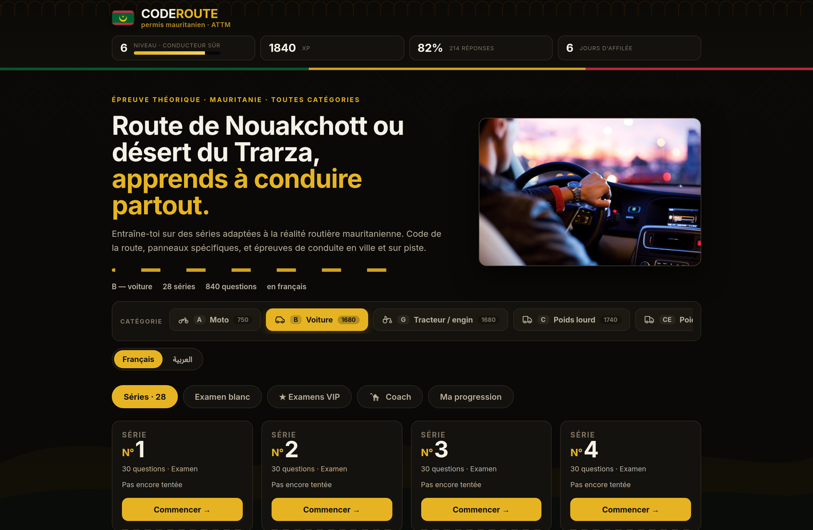

---

## About

Coderoute MR is a free, account-free web app for practising the Mauritanian driving-theory
exam (*épreuve théorique*). It covers **every licence category** — motorcycle, car, tractor,
heavy goods, bus and trailer combinations — with **11,000+ picture questions** in French and
Arabic, immediate correction, timed mock exams, a personal coach and local progress tracking.

Everything runs in the browser. There is no backend, no sign-up and no tracking: progress lives
in `localStorage` on the learner's own device, which matters for users on metered mobile data.

The interface is deliberately built around the visual language of the road — lane markings,
signage colours, a dashed-line progress bar — and dressed in the colours of the Mauritanian flag.

## Features

| | |
|---|---|
| **All licence categories** | Motorcycle (A), car (B), tractor / plant (G), heavy goods (C, CE), public transport (D) and trailers (BE, DE), each with its own question bank and series. |
| **Bilingual FR / AR** | Every category ships in French and Arabic where available, switchable in one click, with automatic fallback to Arabic for Arabic-only categories. Full RTL layout. |
| **Picture-based quiz** | Scene photo + question banner + أ / ب / ج answers (2 or 3 choices, detected per question) with a visual correction overlay. |
| **Timed mock exam** | 30 questions drawn at random per category, 20-minute clock, no correction until the end — the conditions of exam day. |
| **VIP exams** | Three premium formats: Royal (40 questions / 25 min), Marathon (60 questions / 45 min) and Eliminatory Special, drawn only from the questions that fail candidates. |
| **Personal coach** | Level diagnosis, the next series to attempt, mistakes to review, a streak counter, and advice tuned to local driving conditions — sand on the carriageway, tracks, livestock, right-of-way. |
| **Mistake review** | Every wrong answer is remembered and can be replayed as a dedicated set until it is cleared. |
| **Eliminatory flags** | Questions that alone can fail a candidate are marked as such during practice. |
| **Local progress** | XP, levels, day streak and best score per series — stored in `localStorage`, never sent anywhere. |

## Screenshots

### Practice series and immediate correction

<table>
<tr>
<td width="50%">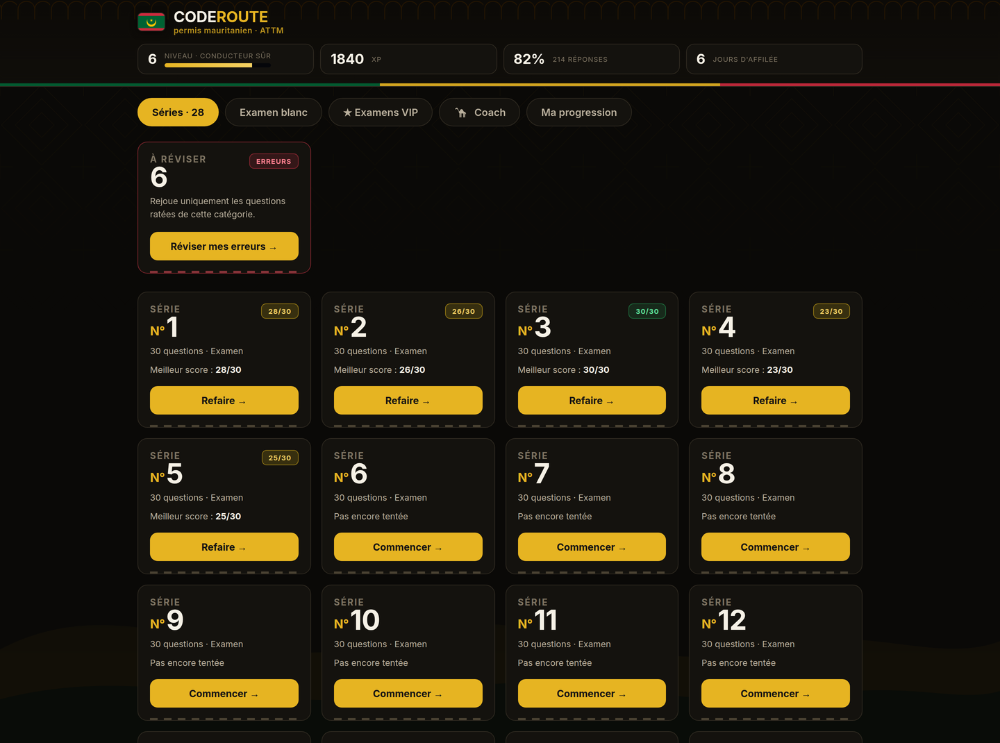</td>
<td width="50%">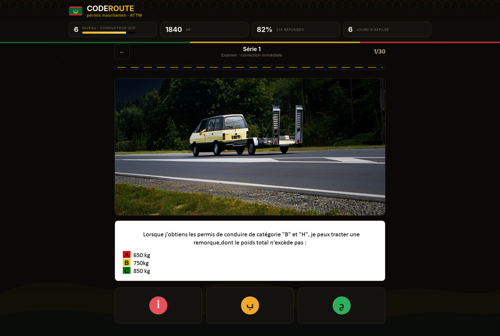</td>
</tr>
<tr>
<td align="center"><em>Series grid — best score per set, mistakes queued for review</em></td>
<td align="center"><em>Picture question — scene photo, question banner, أ / ب / ج answers</em></td>
</tr>
<tr>
<td width="50%">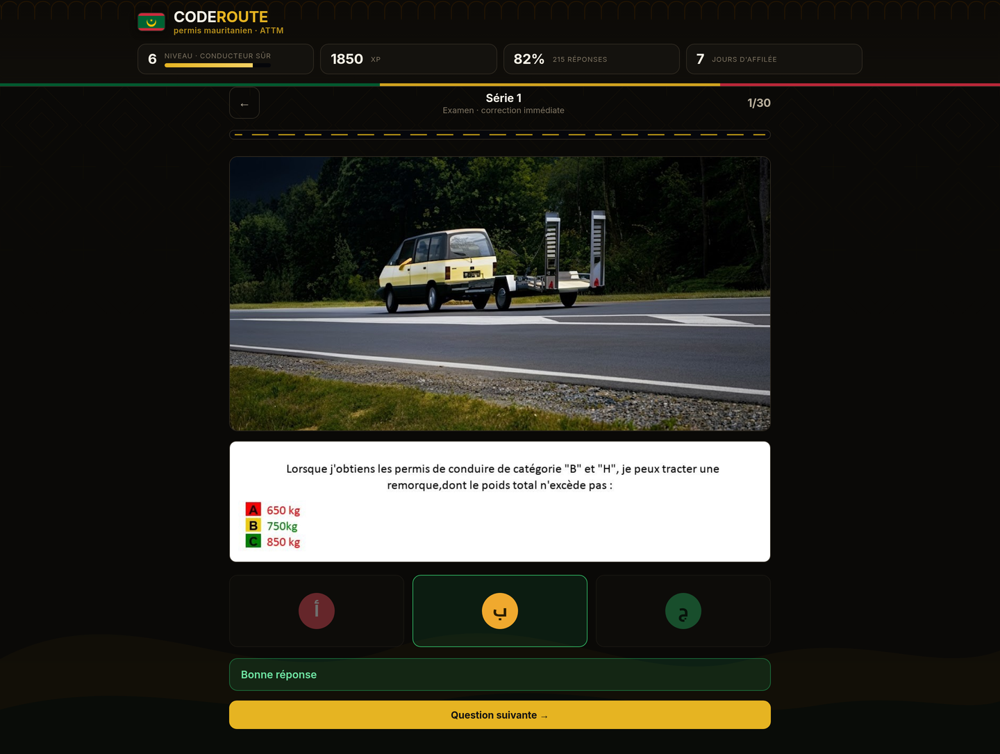</td>
<td width="50%">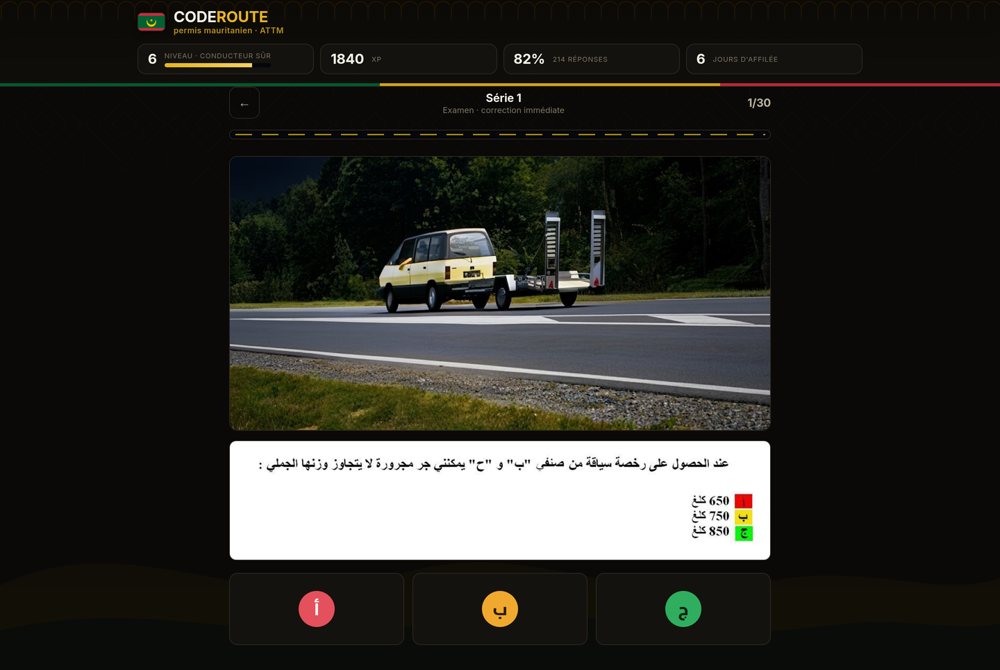</td>
</tr>
<tr>
<td align="center"><em>Correction — the banner swaps to the corrected answer key</em></td>
<td align="center"><em>The same question in Arabic, right-to-left</em></td>
</tr>
</table>

### Exams, coach and progress

<table>
<tr>
<td width="50%">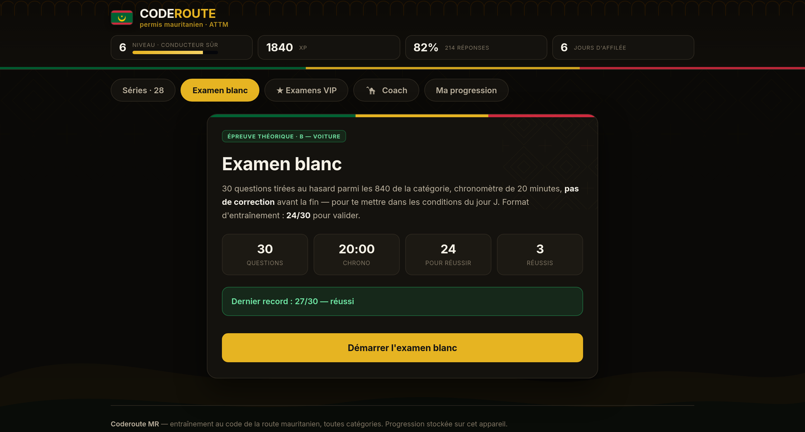</td>
<td width="50%">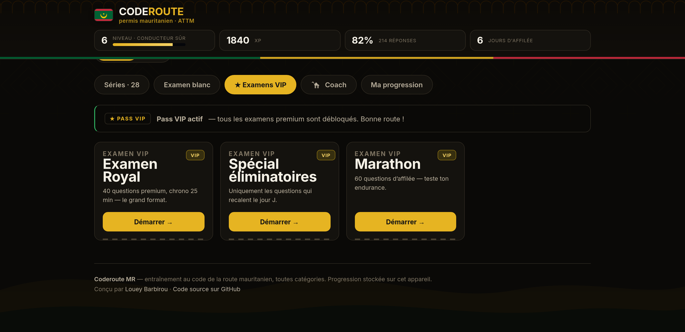</td>
</tr>
<tr>
<td align="center"><em>Timed mock exam — 30 questions, 20 minutes, 24/30 to pass</em></td>
<td align="center"><em>VIP exams — Royal, Eliminatory Special and Marathon</em></td>
</tr>
<tr>
<td width="50%">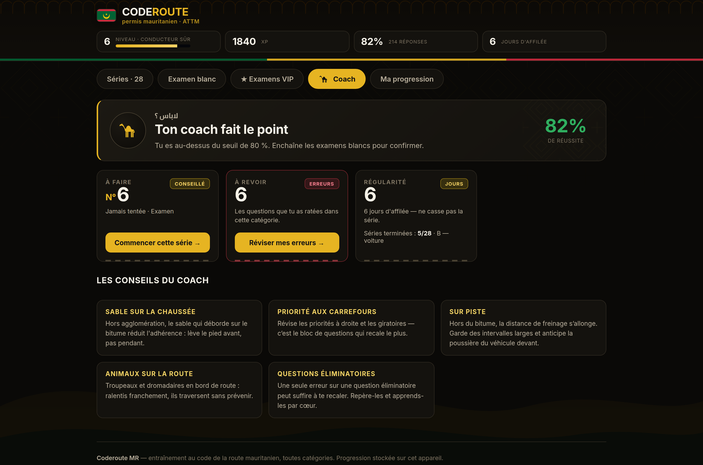</td>
<td width="50%">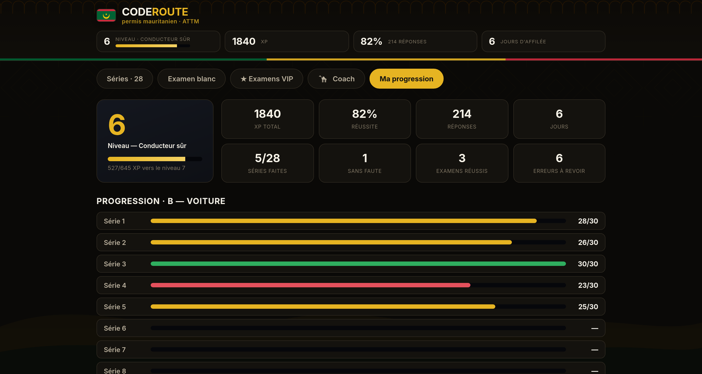</td>
</tr>
<tr>
<td align="center"><em>Coach — diagnosis, what to do next, local driving advice</em></td>
<td align="center"><em>Progress — XP, level, streak and best score per series</em></td>
</tr>
</table>

### Mobile

<table>
<tr>
<td width="33%">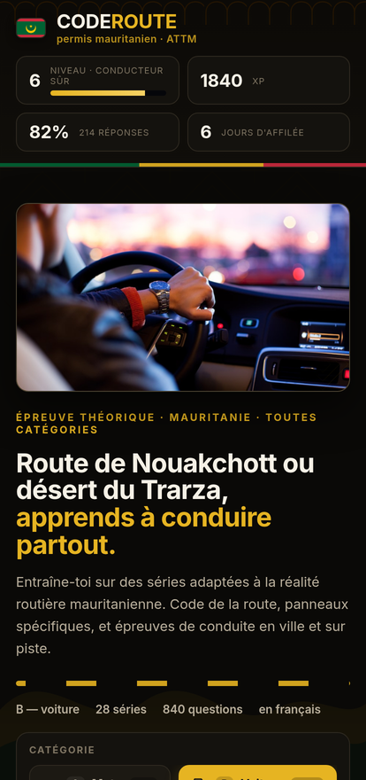</td>
<td width="33%">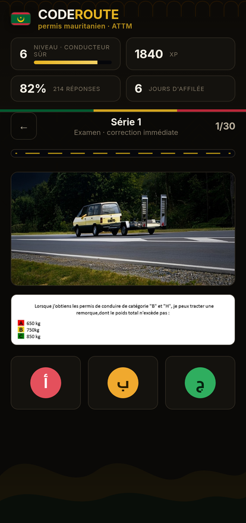</td>
<td width="33%">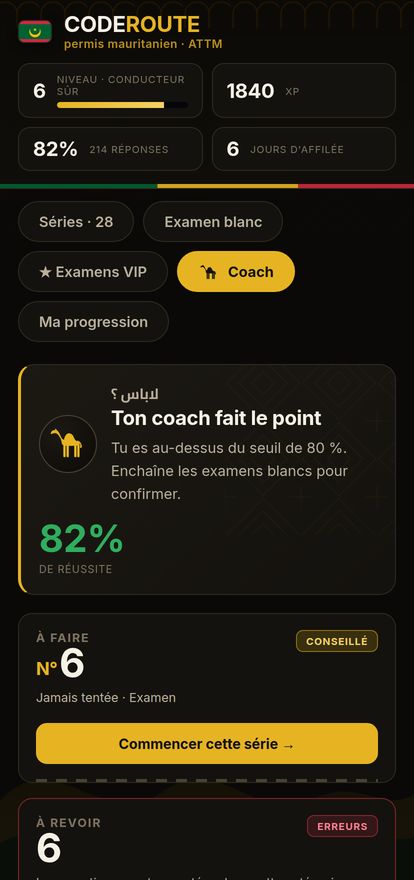</td>
</tr>
<tr>
<td align="center"><em>Home</em></td>
<td align="center"><em>Quiz</em></td>
<td align="center"><em>Coach</em></td>
</tr>
</table>

## Tech stack

| Layer | Choice | Why |
|---|---|---|
| Framework | React 18 | Small component tree, no router needed — tabs are driven by the URL hash. |
| Build | Vite 5 | Fast dev server, ~58 kB gzipped JS bundle, ~7 kB CSS. |
| Styling | Hand-written CSS | No UI framework. `styles.css` holds the structure, `styles/theme-mr.css` re-skins it. |
| State | `useSyncExternalStore` + `localStorage` | A ~80-line store ([`store.js`](app/src/lib/store.js)), no state library. |
| Fonts | Archivo Expanded, Inter, Cairo | Cairo carries the Arabic typography. |
| Question images | Cloudflare R2 (public bucket) | Keeps ~11,000 images out of the repo and off the build. |
| Hosting | Vercel (static) | The whole app is pre-rendered static files. |

No backend, no database, no analytics, no cookies.

## Project structure

```
.
├── app/                          # the Vite application
│   ├── public/
│   │   ├── data/
│   │   │   ├── crt/              # picture question catalogue
│   │   │   │   ├── index.json    # categories, languages, series counts, R2 base URL
│   │   │   │   └── {A,B,C,CE,D,DE,BE,G}.json
│   │   │   └── questions.json    # legacy text-based question set
│   │   ├── images/               # images for the legacy text set
│   │   ├── _redirects            # SPA routing for Cloudflare Pages / Netlify
│   │   ├── robots.txt
│   │   └── sitemap.xml
│   └── src/
│       ├── components/           # TopBar, CategoryBar, SeriesView, QuizPlayer, ExamView,
│       │                         # VipView, CoachView, StatsView, Testimonials…
│       ├── lib/
│       │   ├── brand.js          # ← all country-specific content lives here
│       │   ├── helpers.js        # grouping, shuffling, quiz identifiers
│       │   └── store.js          # XP, levels, streak, best scores, mistakes
│       ├── styles.css            # base layout and components
│       └── styles/theme-mr.css   # Mauritanian skin, loaded after styles.css
├── docs/screenshots/
├── .github/workflows/build.yml   # CI: install + production build on every push
└── vercel.json                   # build command, output directory, SPA rewrites, cache headers
```

### Question data model

The catalogue in `app/public/data/crt/index.json` declares the categories; each category points
to its own JSON file. A picture question looks like this:

```json
{
  "cat": "B", "lang": "fr",
  "subSlug": "examen", "subLabel": "Examen", "subType": "examen",
  "serie": 1, "q": 1,
  "correctIndex": 2, "nOptions": 3, "critical": true,
  "img": {
    "scene":    "https://…/B/examen/serie1/1_e.jpg",
    "question": "https://…/B/examen/serie1/1_q.jpg",
    "answer":   "https://…/B/examen/serie1/1_r.jpg"
  }
}
```

Swapping in a different question bank means producing files in this shape and updating
`index.json` — no component changes are required.

## Getting started

Requirements: **Node.js 18+** and npm.

```bash
git clone https://github.com/AymanMady/code-route-mr.git
cd code-route-mr/app

npm install
npm run dev        # http://localhost:5173
```

Other scripts:

```bash
npm run build      # production build into app/dist
npm run preview    # serve the production build locally
```

The question images are fetched from a public Cloudflare R2 bucket, so the dev server needs
network access to display them. Everything else works offline.

## Deployment

The app is a static bundle and deploys anywhere that serves files, as long as unknown paths
fall back to `index.html`.

### Vercel (recommended)

[`vercel.json`](vercel.json) at the repository root already describes the build, so importing the
repo needs no dashboard configuration:

```jsonc
{
  "installCommand":   "npm --prefix app ci",
  "buildCommand":     "npm --prefix app run build",
  "outputDirectory":  "app/dist",
  "rewrites": [{ "source": "/(.*)", "destination": "/index.html" }]
}
```

1. Push the repository to GitHub.
2. On [vercel.com/new](https://vercel.com/new), import it. Leave **Root Directory** as `./` — the
   config handles the `app/` sub-directory.
3. Deploy. Every push to `main` ships a new production build; pull requests get preview URLs.

Or from the CLI:

```bash
npm i -g vercel
vercel          # preview deployment
vercel --prod   # production deployment
```

### Cloudflare Pages / Netlify

`app/public/_redirects` already provides the SPA fallback for both.

```bash
cd app
npm run build
npx wrangler pages deploy dist --project-name=code-route-mr
```

### Sub-directory hosting (GitHub Pages project site)

The build defaults to a root public path. For a sub-path, set `VITE_BASE`:

```bash
VITE_BASE=/code-route-mr/ npm run build
```

### After deploying to a custom domain

Update the canonical URL in [`app/index.html`](app/index.html), the `Sitemap:` line in
[`app/public/robots.txt`](app/public/robots.txt), the `<loc>` in
[`app/public/sitemap.xml`](app/public/sitemap.xml) and `BRAND.site` in
[`app/src/lib/brand.js`](app/src/lib/brand.js).

## Localization

Everything country-specific is centralised in **[`app/src/lib/brand.js`](app/src/lib/brand.js)**:
brand name and tagline, issuing authority, hero copy, licence category labels and local
terminology, XP level names, currency and payment methods, testimonials, coach advice, exam
format and `localStorage` keys.

Retargeting the app to another country means editing that one file plus the question dataset.
The visual skin — colour tokens, geometric patterns, dunes, the dromedary pictogram and the
coach view — lives in **[`app/src/styles/theme-mr.css`](app/src/styles/theme-mr.css)**, which is
loaded after `styles.css` and only re-skins it.

The mock-exam format is defined in three constants:

```js
export const EXAM_SIZE = 30;         // questions per mock exam
export const EXAM_PASS = 24;         // correct answers needed to pass
export const EXAM_TIME = 20 * 60;    // seconds on the clock
```

## Known limitations

> [!IMPORTANT]
> **The question content is not Mauritanian yet.** The series currently served come from the
> original North African dataset the project was built on. The interface, terminology, categories
> and coach advice are fully localised, but the questions themselves still need to be replaced
> with an ATTM-sourced bank. The catalogue plugs in through
> `app/public/data/crt/index.json` using the schema above.

> [!NOTE]
> **The exam format is a training format.** `EXAM_SIZE` / `EXAM_PASS` / `EXAM_TIME`
> (30 questions / 24 to pass / 20 minutes) were chosen for the app and are not a reproduction of
> an official ATTM scale. Adjust them in `brand.js` if the real format differs.

> [!NOTE]
> **The VIP pass is a mock paywall.** Unlocking it flips a `localStorage` flag; there is no
> payment processing, and the listed payment methods are illustrative.

## Assets

- `app/public/images/people/hero.jpg` — the hero image. Swap it for a local road or track
  scene; if the file is removed, a vector fallback (track and dunes) renders in its place.
- `app/public/images/people/p1.jpg` … `p3.jpg` — unused. Testimonials render monograms instead.

## Contributing

Issues and pull requests are welcome — particularly a Mauritanian question bank, corrections to
the local terminology, and Arabic copy review.

## License

[MIT](LICENSE) © Bechir Mady

<div align="center">
<sub>Built as a learning and portfolio project. Not affiliated with ATTM.</sub>
</div>
